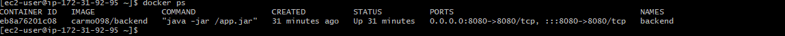
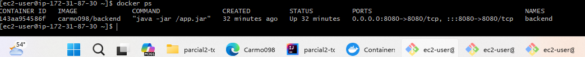
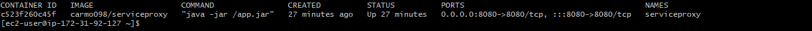
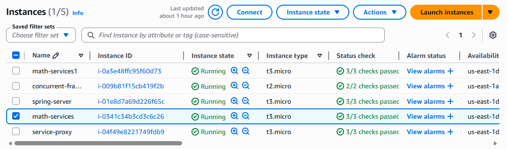
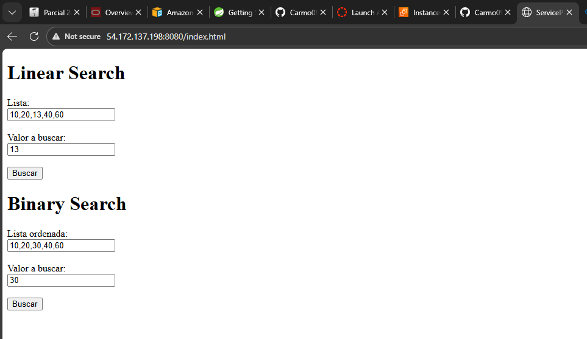

# parcial2-tdse

### Santiago Carmona Pineda

### Enunciado
Funciones de ordenamiento: Sus servicios deben incluir dos funciones. Uno recibe una lista de cadenas y un valor a buscar e implementa la búsqueda lineal : linearSearch(lista, valor) retorna un json con el índice de la primera aparición del valor o con -1 si no encuentra el valor Uno recibe una lista ordenada de cadenas y un valor a buscar e implementa la búsqueda binaria de manera recursiva : binarySearch(n), retorna un json con el índice de la primera aparición del valor o con -1 si no encuentra el valor. PARA AMBAS IMPLEMENTACIONES ESCRIBA EL ALGORITMO. Usted debe implementar las dos funciones, no debe usar funciones de una librería o del API (si ya existen).

Búsqueda Lineal La búsqueda lineal, también conocida como búsqueda secuencial, es un método simple y directo para encontrar un elemento en un conjunto de datos. Funciona de la siguiente manera:

Búsqueda Binaria La búsqueda binaria es un método más eficiente que la búsqueda lineal, pero requiere que el conjunto de datos esté ordenado previamente. Su proceso se describe de la siguiente manera:

### Instancias en AWS
Se crearon 3 instancias. 2 que eran para el backend y 1 para la parte del proxy, se tuvo que configurar los grupos de seguridad para agregar el puerto 8080 que es el de springBoot, esto se hizo para las 3 instancias

### Proxy con active-pasive
Para esta parte cuando se tienen corriendo las 2 instancias del backend , se debe interrumpir una de las 2 , para que asi cuando se pruebe la URL va a responder con el servidor secundario.

### Pruebas

### Vídeo
https://drive.google.com/file/d/1X4QZTRDJOTc5Rm9IdiRu4Vo9RbOegMaZ/view?usp=drivesdk